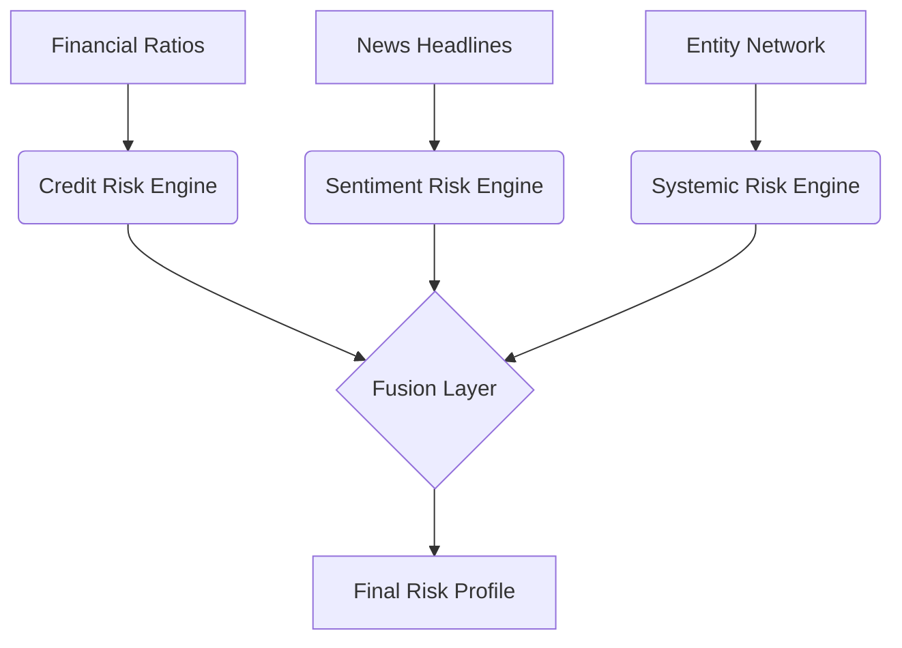

# 🛡️ SentinAL: AI-Driven Financial Risk Intelligence Engine


**SentinAL** is a modular, explainable financial risk intelligence system designed to detect early warning signals of corporate distress. It fuses structured financial data, unstructured news sentiment, and systemic network risk metrics into a unified, interpretable risk profile.

Unlike traditional credit scoring systems that operate in isolation, SentinAL functions as a multi-signal surveillance engine suitable for quantitative research, enterprise risk monitoring, and financial intelligence applications.

---

## 🎯 Core Objectives

1.  **Multi-Modal Detection:** Combine quantitative (balance sheet), qualitative (news), and contagion (network) risk factors.
2.  **Explainability:** Produce risk scores that are traceable back to specific financial ratios or news events.
3.  **Systemic Awareness:** Identify entities that are "too central to fail" via graph theory.
4.  **Reproducibility:** Maintain clean ML engineering practices with separated data and logic.

---

## 🧠 System Architecture

The system operates on a decoupled engine architecture, allowing for independent ablation studies and model upgrades.



*(Note: If the diagram above does not render, it represents data flowing into three distinct engines—Credit, Sentiment, and Systemic—which then feed into a weighted Fusion Layer.)*

---

## 🚀 Key Components

### 1️⃣ Credit Risk Engine (Quantitative)

* **Model:** XGBoost Classifier
* **Inputs:** Financial ratios (Leverage, ROA, Operating Margin, Liquidity)
* **Output:** Probability of Default (PD) → Normalized Credit Score (0–100)
* **Design Goal:** Establish a strong baseline solvency assessment based on hard numbers.

### 2️⃣ Sentiment Risk Engine (Qualitative)

* **Model:** FinBERT (ProsusAI)
* **Inputs:** Financial news headlines and unstructured text.
* **Method:** Transformer-based sentiment inference (Positive/Neutral/Negative).
* **Output:** Aggregated sentiment polarity score.
* **Design Goal:** Capture market fear, fraud allegations, and narrative risks invisible to balance sheets.

### 3️⃣ Systemic Risk Engine (Network-Based)

* **Method:** Graph Analytics (NetworkX)
* **Metrics:** PageRank Centrality, Node Degree.
* **Inputs:** Entity-to-entity transaction/exposure network.
* **Output:** Contagion-aware systemic risk score.
* **Design Goal:** Quantify the potential for cascading failure and identify central nodes.

### 4️⃣ Fusion & Decision Layer

* **Logic:** Weighted Ensemble Aggregation.
* **Configuration:** * Credit: ~50%
* Sentiment: ~30%
* Systemic: ~20%


* **Output:** Composite Risk Score & Risk Tier (Low | Medium | High | Critical).

---

## 🛠️ Technology Stack

| Layer | Tools |
| --- | --- |
| **Core** | Python 3.9+ |
| **Data Processing** | Pandas, NumPy |
| **Machine Learning** | XGBoost, Scikit-Learn |
| **NLP** | HuggingFace Transformers, PyTorch, FinBERT |
| **Graph Analytics** | NetworkX |
| **Visualization** | Streamlit, Plotly Express |

---

## ⚙️ Installation & Reproducibility

To ensure a clean environment, data and models are not committed to the repository. Follow these steps to reproduce the environment:

### 1. Clone the Repository

```bash
git clone [https://github.com/CholaGanesh05/SentinAL.git](https://github.com/CholaGanesh05/SentinAL.git)
cd SentinAL

```

### 2. Create Virtual Environment

```bash
# Windows
python -m venv venv
.\venv\Scripts\activate

# macOS / Linux
python3 -m venv venv
source venv/bin/activate

```

### 3. Install Dependencies

```bash
pip install -r requirements.txt

```

### 4. Data Setup (Important)

Since `data/`, `models/`, and `outputs/` are git-ignored to maintain repository hygiene, you must ensure the folder structure exists locally:

```bash
# The system expects these folders
mkdir data
mkdir models
mkdir outputs

```

*(Note: Place your source CSVs in `data/` and trained models in `models/` before running analysis.)*

### 5. Run End-to-End Analysis

This script executes the full pipeline: Data Ingestion → Inference (Credit/Sentiment/Systemic) → Fusion → Serialization.

```bash
python run_full_analysis.py

```

### 6. Launch Command Center

Visualize the results in the interactive dashboard.

```bash
streamlit run dashboard.py

```

---

## 📂 Project Structure

```text
SentinAL/
├── src/                    # Core Engine Implementations
│   ├── credit_risk/        # XGBoost Logic
│   ├── sentiment_risk/     # FinBERT Logic
│   ├── systemic_risk/      # Graph Theory Logic
│   ├── aggregation/        # Fusion Logic
│   ├── ingestion/          # Data Loaders
│   └── schemas/            # Data Validation (Pydantic)
├── dashboard.py            # Streamlit Visualization Layer
├── main.py                 # Application Wrapper
├── run_full_analysis.py    # Batch Execution Pipeline
├── requirements.txt        # Dependency Definitions
└── README.md               # Documentation

```

---

## 📊 Design Principles

1. **Modularity:** Each risk engine functions independently. A failure in the news feed does not stop the credit analysis.
2. **Explainability:** Scores are not black boxes; the dashboard provides drill-down capabilities to see exactly *why* a score is high (e.g., "High Debt" vs "Negative News").
3. **Clean Architecture:** Separation of concerns between data processing, inference logic, and visualization.

---

## 📜 License

This project is licensed under the MIT License.

```
